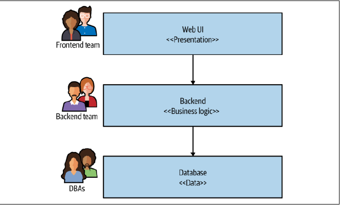

# فصل اول: میکروسرویس‌ها چیستند؟

میکروسرویس‌ها سرویس‌هایی هستن که به‌طور مستقل قابل انتشارن و حول یک دامینِ کسب‌وکار (**Business Domain**) مدل‌سازی می‌شن.

در واقع هر سرویس وظایف و عملکردهای خودش رو کپسوله‌سازی (پنهان) می‌کنه و از طریق شبکه یا یک **Gateway** در دسترس بقیهٔ سرویس‌ها قرار میده. به این ترتیب تو می‌تونی سیستم‌های پیچیده‌تر رو از کنار هم چیدن این بلوک‌های ساختمانی بسازی.

مثلاً ممکنه یک میکروسرویس مسئول انبارداری باشه، یکی مدیریت سفارش‌ها رو بر عهده بگیره و یکی هم مربوط به ارسال کالا باشه؛ اما در کنار هم یک سیستم تجارت الکترونیک (**E-commerce**) کامل رو شکل می‌دن.

میکروسرویس‌ها نوعی معماری **سرویس‌گرا (SOA)** هستن. این سرویس‌ها نسبت به تکنولوژی بی‌طرف یا اصطلاحاً **Technology-Agnostic** هستن که این خودش یک مزیت بزرگ محسوب میشه.

از بیرون که نگاه کنی، تکنولوژی‌ای که سرویس باهاش نوشته شده یا روش ذخیره‌سازی داده‌ها کاملاً از دید دنیای بیرون پنهان می‌مونه. این یعنی در بیشتر شرایط، اونا از دیتابیس‌های مشترک دوری می‌کنن و در عوض، هر سرویس دیتابیس اختصاصی خودش رو می‌سازه.

میکروسرویس‌ها مفهوم مخفی‌سازی اطلاعات (**Information Hiding**) رو با آغوش باز می‌پذیرن. این یعنی تا جای ممکن جزئیات رو داخل یک کامپوننت پنهان کنی و کمترین مقدار ممکن رو از طریق اینترفیس‌های بیرونی لو بدی. این کار کمک می‌کنه مرز مشخصی بین چیزهایی که به‌راحتی تغییر می‌کنن و چیزهایی که تغییرشون سخت‌تره ایجاد بشه.

> پیاده‌سازی داخلی که از دید بقیه پنهان شده رو می‌شه آزادانه تغییر داد، به شرطی که اینترفیس‌های شبکه‌ایِ سرویس دچار تغییرات ناسازگار با گذشته نشن و اصطلاحاً **Backward Compatible** باقی بمونن.

داشتن مرزهای شفاف و پایدار که با تغییر پیاده‌سازی داخلی عوض نمی‌شن، به سیستم‌هایی ختم می‌شه که وابستگی کمتری به هم دارند (**Looser Coupling**) و همبستگی داخلی‌شون قوی‌تره (**Stronger Cohesion**).

یکی از الگوهای معماری جذاب در این زمینه، **معماری شش‌ضلعی (Hexagonal Architecture)** است که اولین بار توسط آلیستر کاکبرن مطرح شد. این معماری روی اهمیت جدا نگه داشتن پیاده‌سازی داخلی از اینترفیس‌های بیرونی تأکید داره؛ با این ایده که شاید دلت بخواد با یک کارکرد یکسان، از طریق اینترفیس‌های مختلفی (مثل وب، موبایل یا بقیه سرویس‌ها) تعامل داشته باشی.

---

### آیا معماری سرویس‌گرا و میکروسرویس‌ها با هم فرق دارند؟

در معماری سرویس‌گرا یا همون **SOA**، چند تا سرویس با هم همکاری می‌کنن تا یک قابلیت نهایی رو به کاربر ارائه بدن. ارتباط این سرویس‌ها به جای فراخوانی متدها در یک پروسس، از طریق تماس‌هایی در بستر شبکه اتفاق می‌افته.

معماری **SOA** به‌عنوان راهکاری برای مبارزه با چالش‌های اپلیکیشن‌های بزرگ و یکپارچه (**Monolith**) ظهور کرد. هدف اصلیش بالا بردن قابلیت بازآفرینی و استفادهٔ مجدد از نرم‌افزار بود؛ مثلاً اینکه چند تا اپلیکیشن بتونن از یک سرویس مشترک استفاده کنن. در اصل **SOA** می‌خواد نگهداری و بازنویسی نرم‌افزار رو راحت‌تر کنه.

معماری **SOA** در ذات خودش ایدهٔ بسیار معقولیه، اما با وجود تلاش‌های زیاد، هیچ‌وقت یک اجماع و تفاهم کلیِ خوب روی اینکه چطور می‌سه اون رو به بهترین شکل انجام داد شکل نگرفت.

خیلی از مشکلاتی که به پای **SOA** نوشته می‌شن، در واقع مربوط به پروتکل‌های ارتباطی پیچیده (مثل SOAP)، میان‌افزارهای تجاری (**Vendor Middleware**)، کمبود راهنمایی درباره اندازه و گرینولاریتی سرویس‌ها، یا راهنمایی‌های غلط درباره انتخاب جاهای مناسب برای شکستن سیستم هستن.

من نمونه‌های زیادی از **SOA** دیدم که توشون تیم‌ها تلاش می‌کردن سرویس‌ها رو کوچک‌تر کنن، اما هنوز همه‌چیز به یک دیتابیس مشترک وصل بود و مجبور بودن همه‌چیز را با هم دپلوی کنند. سرویس‌گرا بود؟ بله. اما میکروسرویس؟ اصلاً!

رویکرد میکروسرویس از دل تجربه‌های دنیای واقعی بیرون اومده و از درک بهتر ما نسبت به سیستم‌ها و معماری استفاده کرده تا بتونه مفهوم **SOA** رو به نحو احسن و به بهترین شکل ممکن پیاده کنه.

---

### مفاهیم کلیدی میکروسرویس‌ها

#### ۱. قابلیت استقرار مستقل (Independent Deployability)

قابلیت استقرار مستقل یعنی اینکه ما بتونیم یک تغییر تو یک میکروسرویس ایجاد کنیم، دپلویش کنیم و اون تغییر رو در اختیار کاربرامون قرار بدیم، بدون اینکه نیاز باشه هیچ میکروسرویس دیگه‌ای رو دپلو کنیم.

مهم‌تر از اون، بحث فقط این نیست که «می‌تونی» این کار رو بکنی؛ بلکه بحث اینه که تو باید دپلویمنت‌ها رو تو سیستمت همین‌جوری مدیریت کنی و این رو به روش پیش‌فرض انتشارت تبدیل کنی.

> **اگه قرار باشه از این کتاب فقط و فقط یک چیز یاد بگیری، باید همین باشه:**
> 
> عادت کنی تغییرات رو روی یک سرویس واحد دپلوی و منتشر کنی، بدون اینکه مجبور باشی چیز دیگه‌ای رو دپلوی کنی. از پسِ این کار، کلی اتفاق خوبِ دیگه رقم می‌خوره.

برای تضمین این قابلیت، باید مطمئن باشیم میکروسرویس‌هامون وابستگی کمی به هم دارن (**Loosely Coupled**): یعنی بتونیم یک سرویس رو بدون نیاز به تغییر دادن بقیه چیزها عوض کنیم. 

بعضی از انتخاب‌ها تو مرحله‌ی پیاده‌سازی این کار رو سخت می‌کنن؛ مثلاً به اشتراک گذاشتن دیتابیس‌ها به‌شدت مشکل‌سازه. تمایل به داشتن میکروسرویس‌های کم‌وابسته با اینترفیس‌های پایدار، راهنمای تفکر ما درباره اینه که اصلاً چطور مرزهای میکروسرویس‌هامون رو در قدم اول پیدا کنیم.

#### ۲. مدل‌سازی حول یک دامین کسب‌وکار (Modeled Around a Business Domain)

تو معماری میکروسرویس، ما از تکنیک‌های **طراحی دامین-محور (Domain-Driven Design یا DDD)** استفاده می‌کنیم. با مدل‌سازی سرویس‌ها حول دامین‌های کسب‌وکار، می‌تونیم ارائه قابلیت‌های جدید و ترکیب مجدد میکروسرویس‌ها به روش‌های مختلف رو برای کاربران خیلی راحت‌تر کنیم.

ارائه قابلیتی که نیاز به تغییر در بیش از یک میکروسرویس داره، هزینه‌بره. تو باید کارها رو بین هر سرویس (و احتمالاً تیم‌های مجزا) هماهنگ کنی و ترتیب دپلوی شدن نسخه‌های جدید این سرویس‌ها رو با دقت مدیریت کنی. این کار خیلی بیشتر از ایجاد همون تغییر داخل یک سرویس واحد (یا داخل یک سیستم **Monolith**) زحمت داره. بنابراین کاملاً طبیعیه که دنبال راه‌هایی باشیم تا تغییرات بین سرویس‌ها رو تا حد ممکن به حداقل برسونیم.

من معمولاً معماری‌های لایه‌ای رو می‌بینم که نمونه‌ش معماری سه‌لایه سنتی تو شکل زیر هست:

اینجا هر لایه تو معماری، نشون‌دهنده یک مرز سرویس متفاوت هست که هر مرز بر اساس کارکرد فنی مربوط به خودش شکل گرفته.

اگه تو این مثال نیاز باشه فقط لایه نمایش (**Presentation**) رو تغییر بدم، این کار نسبتاً کارآمده. اما تجربه نشون داده که تغییرات در عملکردهای سیستم معمولاً چند لایه رو در این نوع معماری‌ها در بر می‌گره؛ یعنی هم‌زمان نیاز به تغییر در لایه‌های نمایش، اپلیکیشن و داده داره.

این مشکل زمانی بدتر می‌شه که معماری از مثال ساده داخل شکل هم لایه‌لایه‌تر باشه، چون اغلب هر تیره (**Tier**) خودش به لایه‌های بیشتری تقسیم می‌شه.

با تبدیل سرویس‌هامون به برش‌های سرتاسری (**End-to-End**) از عملکردهای کسب‌وکار، مطمئن می‌شیم که معماریمون جوری چیده شده تا تغییرات در قابلیت‌های بیزنسی تا حد ممکن کارآمد باشه.

به تعبیری، ما با انتخاب میکروسرویس‌ها تصمیم گرفتیم که **همبستگی بالای اهداف کسب‌وکار (High Cohesion of Business Functionality)** رو به همبستگی بالای اهداف فنی ترجیح بدیم.

